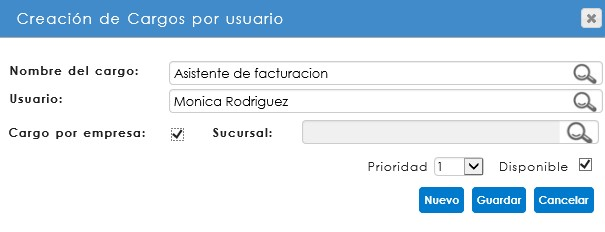
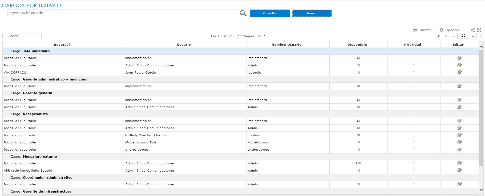
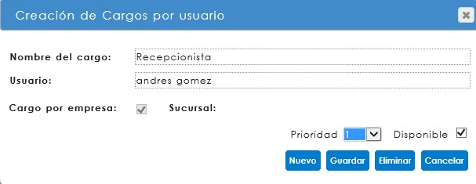

[INICIO](index.md)

## CORRESPONDENCIA ENTRANTE  

---
### CONFIGURACIONES PREVIAS  

Para que el módulo opere correctamente se requiere de una parametrización previa de acuerdo a la gestión de cada empresa, con esto será posible la administración de la correspondencia.

#### CONSECUTIVOS DE CORRESPONDENCIA

Previo a la creación de los tipos de correspondencia, es necesario realizar las parametrizaciones básicas que permitirán la configuración del submódulo, teniendo en cuenta el proceso de radicación de todos los tipos de correspondencia, ya sea entrante, saliente, interna y comunicado interno. 

##### Tipos de Consecutivos 

Al ingresar a la ruta SGD / CONFIGURACIÓN / CORRESPONDENCIA / CONSECUTIVOS /TIPO DE CONSECUTIVOS, se abrirá una página para la creación de los Tipos de consecutivos, de acuerdo al Tipo de correspondencia a radicar.

El nombre del Tipo de consecutivo es asignado de acuerdo a la configuración que así haya determinado la empresa. Tenga en cuenta que es posible eliminar un Tipo de consecutivo creado si éste no ha sido utilizado. 

En el campo seleccionado se debe digitar el nombre que se dará al Tipo de consecutivo, de acuerdo al Tipo de correspondencia, si así se define. Al guardar se creará como parte de la lista.

El sistema indicará la cantidad de registros y páginas existentes en la parte superior del listado. Si éste supera los 5 registros, el sistema irá creando nuevas páginas, en las cuales se podrá consultar o editar el nombre del consecutivo.

##### Consecutivos

Al ingresar a la ruta SGD / CONFIGURACIÓN / CORRESPONDENCIA / CONSECUTIVOS / CONSECUTIVOS se abrirá una página para la configuración de los consecutivos al Tipo de consecutivo creado.

 

Los consecutivos de correspondencia deben estar vinculados a una sucursal de SINCO ERP, sobre la cual se haya definido el registro de la correspondencia. En esta opción se podrán aplicar filtros iniciales, ya sea por sucursal o por tipo de consecutivo creado. También, al hacer clic sobre el botón Consultar, el sistema desplegará la tabla Configuración. 

Si ya existen registros relacionados, no se podrán editar los consecutivos previamente configurados.

Para configurar un nuevo consecutivo, se debe iniciar con la selección de Sucursal y Tipo de consecutivo.

Una vez se hayan seleccionado los campos iniciales, se debe realizar la asignación del prefijo, dato de identificación que irá impreso en el sticker. Así mismo, se ingresarán los rangos de consecutivos, donde el inicial corresponde al número en que iniciará el código, y el final hace referencia al límite de dígitos al que llegará el consecutivo.

Para conservar los cambios, haga clic en ***Guardar***.

<a href="#arriba">Ir arriba</a>

#### TIPOS DE CORRESPONDENCIA

Al ingresar a la ruta SGD/ CONFIGURACIÓN / CORRESPONDENCIA / TIPOS DE CORRESPONDENCIA, se abrirá un informe, en donde usted podrá consultar aquellos tipos de correspondencia ya creados. En el caso de que requiera crear un nuevo tipo de correspondencia, debe hacer clic en el botón ***Nuevo***.

##### CREACION DE TIPOS DE CORRESPONDENCIA

Al hacer clic en esta opción, se abrirá un modal solicitando la información mínima requerida para crear un nuevo Tipo de correspondencia.

Los datos iniciales son:

  

**Clase**: Se relaciona con el tipo de correspondencia que se requiere crear: entrante (recibida), saliente (enviada), interna (vinculada con el sistema de gestión de calidad – Complemento Excel) y comunicados internos (memorandos). Este ítem es una lista desplegable donde se podrá seleccionar la clase a crear, campo obligatorio en la creación de un nuevo tipo de correspondencia. 

**Descripción**: Hace referencia al nombre que identifica el tipo de correspondencia en el momento de la radicación. Este espacio de texto es obligatorio.

**Tipología**: Este campo se vincula a una tipología de la política de retención documental (aplica solo para correspondencia entrante e interna que requiera la asignación de datos adicionales), facilitando la ubicación de las correspondencias en una carpeta de archivo. Para realizar el vínculo es necesario digitar el código de la tipología tal como está en la política. 

**Consecutivo**: Hace referencia al código que será asignado como radicado de una comunicación, éste únicamente aplica para la clase Entrante y Saliente. Este campo no es obligatorio para el registro del tipo de correspondencia, sin embargo, condicionará la asignación del consecutivo de identificación al momento del radicado.

Esta página además permite determinar las condiciones de digitalización y registro de datos básicos, al momento de radicar o confirmar la correspondencia.  

  

**Activo**: habilita al tipo de correspondencia que se está creando en la página de radicación de correspondencia, ya sea entrante, saliente o comunicado interno, para permitir su registro.

**Adjuntar archivo**: permite la digitalización del documento al momento de la radicación para la correspondencia entrante, comunicado interno y en la confirmación de entrega para la correspondencia saliente.

**Datos básicos**: habilita o deshabilita los datos básicos en el formulario de radicación. Solo aplica para la correspondencia entrante.

**Generar actividad pendiente**: Permite asignar múltiples destinatarios a la correspondencia, para ser notificados y generar actividad pendiente. Si se habilita esta casilla, no permitirá la configuración de un flujo programado.

**Requiere permisos**: Esta opción funciona para otorgar permisos sobre el tipo de correspondencia creado. Aplica para la clase de correspondencia interna. 

Desde esta ventana se deben asignar las notificaciones de acuerdo al tipo de correspondencia y flujo. Éstas vienen predefinidas y han sido diseñadas desde la configuración de SINCO ERP, a través de la ruta: Configuración/Sistema/Notificaciones/Consulta de notificaciones.

La asignación al tipo de correspondencia enviará un correo electrónico al usuario responsable de ésta, de acuerdo a la configuración de las actividades en el flujo programado. Esta opción es configurable por la empresa, y está diseñada con el propósito de dejar la trazabilidad de la ejecución de las actividades asignadas, o de las acciones que se realicen sobre una correspondencia entrante, interna, comunicado interno y saliente.

  

**Evento**: Responde a cada una de las acciones que pueden ocurrir, con relación al proceso de una correspondencia.

**Notificación**: nombre de la notificación previamente configurada, la cual es asignada al evento que corresponde.

<a href="#arriba">Ir arriba</a>

#### FLUJO PROGRAMADO 

Una vez se ha creado el tipo de correspondencia, se podrá crear o editar el flujo programado que ha sido diseñado para ésta. Para consultar el flujo, se debe hacer clic en el ícono  , que corresponde a la opción de Edición de flujo programado, y se encuentra ubicado en la columna de Acciones del informe de tipos de correspondencia.

Para iniciar con el proceso de diseño, dentro de la ventana se encontrará el paso cero (0) del flujo, que hace referencia al inicio o radicación del documento. Este paso no es editable en cuanto a detalle; de ser necesario, solo se podrá modificar la asignación de descriptores por el tipo de documento radicado.

Para la creación de nuevos pasos para el flujo, se debe hacer clic en el ícono  , ubicado en la parte superior derecha del modal, el cual agregará una nueva actividad o paso.
  

De no requerir ese paso, se podrá eliminar al hacer clic en el icono de eliminar   , ubicado en la parte superior derecha del detalle de la nueva actividad.  

##### ACTIVIDADES

Las actividades corresponden a las acciones o tareas que los usuarios deben ejecutar en el sistema, las cuales pueden ser creadas o editadas a través de la opción ubicada en la parte superior derecha  de la ventana de diseño,  . Al hacer clic se mostrará la siguiente ventana:

Las actividades, al ser de un carácter genérico, podrán ser utilizadas en cualquier tipo de correspondencia; sin embargo, si por alguna razón cambia el tiempo de duración de la actividad, debe ser creada una nueva, para evitar realizar cambios sobre los flujos ya configurados. 

**Búsqueda**: este campo permite realizar la búsqueda de actividades para validar si ya se encuentran creadas, o para editarlas, según sea el caso. De ser necesario editar la actividad, se debe hacer clic sobre el ícono de lápiz . Si por el contrario ésta se va eliminar, se podrá ejecutar esta acción al hacer clic sobre la opción de caneca . 

**Nota**: No se podrán eliminar actividades que ya estén asignadas a un flujo programado.

Para crear una nueva actividad, se deben diligenciar los datos mínimos de registro en el campo **Nueva**. Estos datos corresponden a:

**Descripción**: nombre que se dará a la actividad que realizarán los usuarios en el sistema.

**Días de duración**: la cantidad de días (mínimo 1) que tendrán los usuarios para ejecutar, rechazar o cancelar la actividad de un flujo programado; sobre el cual, a partir del vencimiento, generará notificación de actividades vencidas. 

Para finalizar, se debe hacer clic en Guardar, y se alimentará así el maestro de actividades en el sistema.

##### CARGOS

Al igual que las actividades, es posible crear o editar cargos que serán asignados al flujo, por medio de la opción ubicada en la parte superior derecha de la ventana de diseño .

Se recomienda que los cargos sean creados de tipo genérico, con el propósito de asignar diversos usuarios del sistema a éste, sin que esto implique usar los cargos que tienen asignados en SINCO ERP.

Búsqueda: este campo permite realizar la búsqueda de cargos para validar si ya están creados, o para editarlos en caso que así se requiera. De ser necesario editar, se debe hacer clic sobre el ícono de lápiz  ; si por el contrario debe eliminar el cargo, se podrá ejecutar esta acción al hacer clic sobre la opción de caneca  . 

**Nota**: No se podrán eliminar cargos que ya tengan usuarios asignados, o hagan parte de un flujo programado.

Para crear un nuevo cargo, se deben diligenciar los datos mínimos de registro en el campo Nuevo. Estos campos corresponden a:

**Descripción**: nombre que se dará al cargo que realizará la actividad en el sistema.

Para finalizar, se debe hacer clic en Guardar, alimentando así el maestro de cargos en el sistema. 

##### USUARIOS POR CARGOS

Al ingresar a la ruta SGD/ CONFIGURACIÓN / CORRESPONDENCIA / FLUJOS / USUARIOS POR CARGOS se abrirá un nuevo informe, en éste se podrán consultar los cargos y los usuarios asignados. En el caso de que se requiera asociar usuarios al nuevo cargo, se debe hacer clic sobre el botón ***Nuevo***.

El sistema abrirá una ventana modal de Creación de Cargos por usuario, en el que cada uno de los campos son de obligatorio registro.

**Nombre del cargo**: corresponde al cargo identificado desde el ***flujo programado***, sobre el cual se configurarán los usuarios que podrán ejecutar la actividad pendiente en el sistema. 

**Usuario**: En este campo, se podrán buscar los usuarios que serán asignados al cargo. Es importante tener en cuenta que solo se podrán configurar usuarios activos de **SINCO ERP**; si la persona que ejecutará la actividad no es usuario, no podrá ser asociado al cargo. 

Para finalizar la asociación, se debe hacer clic en Guardar. El sistema enlistará en el informe a los usuarios asignados a cada cargo, agrupados por esta categoría, los cuales se podrán editar (activar o desactivar) para la ejecución de actividades.

La edición se realiza desde el usuario, haciendo clic en el ícono correspondiente de la columna Editar 
.

El sistema desplegará de nuevo la ventana de Creación de Cargos por usuario. Al marcar o desmarcar la casilla disponible .
 , se habilitará o deshabilitará el usuario para ser seleccionado en la asignación de actividades de un flujo programado.

<a href="#arriba">Ir arriba</a>

#### DETALLE DEL PASO

Una vez realizado el ***diseño del flujo programado***, se puede dar inicio a la configuración del flujo programado. Cuando se asigna una nueva actividad, se debe hacer clic sobre el título temporal asignado por el sistema para abrir el detalle de ésta. 

En la ventana Detalles del paso se deben definir las acciones que se realizarán o estarán habilitadas durante la ejecución de los pasos del flujo.

##### Descripción del paso

Al hacer clic sobre la opción de Detalle se desplegarán tres campos de configuración. 

**Actividad**: corresponden a las ***actividades*** previamente configuradas, y será la que el usuario ejecute en este paso.

**Cargo**: corresponde al ***cargo*** que realizará la actividad en mención. 

**Observaciones**: esta casilla de texto permite registrar información adicional referente a la ejecución del paso. No es un espacio obligatorio.

##### Vínculos 

La opción de vínculos tiene como objetivo facilitar el acceso a otras opciones del SINCO ERP, o diferentes sitios web, desde la ejecución de la actividad pendiente.

**Estándar**: corresponde a la integración con SINCO ADPRO para realizar la asociación de Actas o entradas de almacén desde SINCO SGD. El estándar se denomina ***Asociación de actas y entradas***.

**Menú ERP**: esta opción permite configurar vínculos a cualquier menú de SINCO ERP. Esta integración con SINCO SGD no implica la ejecución de actividades automáticas.

**Externo**: Se puede registrar una URL externa que se requiera en el paso del flujo programado, por ejemplo, www.sinco.com.co  
 
  

##### Opciones

En esta sección se define el comportamiento requerido para el paso durante la ejecución de la actividad.

  

**Paso activo**: Permite la ejecución del paso y generación de la actividad.

**Ejecutar paso por cargo**: Habilitar esta opción le indica al sistema que la actividad aparecerá como pendiente para todos los usuarios asignados al cargo; sin embargo, cuando un usuario complete la actividad, ésta desaparecerá del buzón de todos.

**Permite cancelar**: Da la posibilidad al usuario de terminar el flujo de correspondencia, sin completar los pasos posteriores.

**Requiere digitalizar**: en el paso en el cual se marque esta casilla, no permitirá la finalización de la actividad hasta tanto no se digitalice algún documento anexo de la correspondencia; siempre y cuando éste no haya sido digitalizado en el registro inicial de la correspondencia.

**Bloquea descriptores**: permite bloquear los descriptores en los pasos siguientes al paso en que se indique. En caso de marcar Bloquear descriptores, siendo éstos obligatorios y que no hayan sido diligenciados, se tendrá que realizar la modificación en el flujo para cambiar la marca, pues no se podrán ejecutar en un paso anterior.  

##### Notificaciones

El sistema permite indicar si se desea enviar notificaciones registradas al tipo de correspondencia, según el evento por paso del flujo de correspondencia requerido.

  

<a href="#arriba">Ir arriba</a>

#### DESCRIPTORES

Cada una de las actividades configuradas en el flujo programado cuenta con un campo de descriptores, el cual permite mover o adicionar información tanto en el paso (0) o radicado, como en algún otro paso del flujo.

Es importante recordar que los descriptores dependerán del vínculo a una tipología documental, configurada en el ***tipo de correspondencia***, debido a que fueron asignados a esa tipología dentro de la política documental, con la condición de obligatorios, múltiples y el correspondiente orden de registro.

<a href="#arriba">Ir arriba</a>

### RADICACIÓN DE CORRESPONDENCIA ENTRANTE GENERAL

Desde la ruta: SGD/Correspondencia/ENTRANTE/Correspondencia entrante se encuentra el formulario de registro de la correspondencia donde, al inicio del campo Tipos de correspondencia, el sistema permitirá seleccionar los tipos de correspondencia activos y creados con la clase Entrante.

  

<a href="#arriba">Ir arriba</a>

### RADICACIÓN DE CORRESPONDENCIA ENTRANTE CON FLUJO PROGRAMADO 

Desde la ruta: SGD/Correspondencia/ENTRANTE/Correspondencia entrante, se encuentra el formulario de registro de la correspondencia. Cuando se trata de un tipo correspondencia al que ha sido previamente configurado un flujo programado, por ejemplo: Facturas, será posible direccionar el documento al responsable del primer paso del flujo, seleccionándolo de una lista desplegable. Además, a través de la asignación de descriptores se podrán agregar nuevos campos que complementen la información del formulario de registro.
 
La recuperación de descriptores en el momento del registro solo será posible si el tipo de correspondencia ha sido vinculado a una tipología documental de las TRD. Tenga en cuenta la precedencia de los descriptores que use, pues estos datos serán incluidos como campos de búsqueda para la recuperación de información. 

  

El sistema permite realizar procesos de verificación de descriptores, con el objetivo de evitar la duplicidad de radicados. Es decir, si se intenta radicar el mismo consecutivo para una factura, el sistema alertará indicando el descriptor repetido y el mensaje de validación, esto garantiza un mayor control en los procesos de correspondencia.

  

Al finalizar la radicación, el sistema a través de una ventana emergente genera el radicado con las siguientes características.

  

En esta ventana se mostrará el número de radicado de la comunicación, podrá realizar la impresión del sticker en el botón   
 ; y se podrá adjuntar la imagen de la correspondencia desde su ordenador, a través de la opción Examinar y Adjuntar, o también digitalizar la comunicación, seleccionando las opciones de calidad y haciendo clic en el botón Digitalizar. Asimismo, es posible adjuntar documentos adicionales a la comunicación en la opción Anexos, con la cual se podrán cargar archivos en diferentes tipos de formato. 
 
Tenga en cuenta que el proceso de digitalización podrá variar de acuerdo a las características y software del scanner, la configuración de resolución y formato del archivo. 

<a href="#arriba">Ir arriba</a>

### ACTIVIDADES PENDIENTES DE CORRESPONDENCIA

Desde la ruta SGD/correspondencia/actividades pendientes, es posible encontrar las actividades asignadas a un usuario dentro de los flujos de correspondencia, o simplemente alguna correspondencia, la cual haya sido asignada a un usuario, y así visualizar un seguimiento. Dicho seguimiento es posible realizarlo por Usuario o por Cargo, según lo establecido previamente en el ***flujo programado del tipo de correspondencia***. 

 

Allí podremos realizar la consulta por los filtros que presenta la página, ubicados en el ícono de ayuda   . En el panel de Actividad se halla la opción de reflejar actividades pendientes por usuario o por cargo, según un flujo de correspondencia. Por otra parte, es posible reasignar la correspondencia. Si la actividad de este paso tiene configurada la reasignación a otro usuario, simplemente debe seleccionarlo de la lista y hacer clic en el botón ***Reasignar***.  

La opción ***Respuesta*** permite contestar la actividad de correspondencia entrante con una actividad de correspondencia saliente. Este botón redireccionará a la página de correspondencia saliente, y enlaza automáticamente la correspondencia a la que se le está dando respuesta.

La sección de descriptores muestra los descriptores que se asociaron en la política documental, mostrando también cuáles son de obligatorio registro y cuáles no. Tenga en cuenta que no se podrán visualizar los que estén asociados a un paso posterior.

 

En el panel anterior se deben ingresar observaciones del paso obligatoriamente. Dentro de la lista desplegable de la opción ***Acción** se desplegarán los siguientes campos, siempre y cuando tenga permiso en la actividad del paso:
 
**Cancelar**: Al seleccionar Cancelar en una actividad, el sistema procederá a anular la correspondencia, por lo que el resto de actividades desaparecerán.

**Rechazar**: Devuelve la actividad al paso anterior, dentro de un flujo programado de correspondencia.

**Completar**: Cuando se encuentra en el último paso de un flujo programado, la acción de completar finalizará el proceso de la correspondencia.  Si se encuentra en un paso intermedio de un flujo, dará por completada la actividad de ese paso; cuando corresponde a una correspondencia sin flujo, la actividad se dará por terminada.  

Por último, en el panel de seguimiento encontramos los pasos anteriores que se han realizado, de manera cronológica. Allí se muestra el paso, la actividad del flujo, el estado y el usuario, con su fecha y hora de ejecución. 

Tenga en cuenta que es posible visualizar a través de ventanas emergentes, más de un documento cargado dentro de la correspondencia. (documento principal – Anexos).

 

<a href="#arriba">Ir arriba</a>

### VISUALIZACIÓN DE FACTURAS EN SINCO A&F

A través de las opciones generar cuentas por pagar actas, generar cuentas por pagar entradas, autorización de cuentas por pagar, generación masiva de comprobantes de egreso y movimientos por tercero del módulo SINCO A&F; esta funcionalidad permite abrir una ventana emergente con el número de radicado asignado en SINCO SGD, el cual queda vinculado a la imagen digitalizada de la factura.

Antes era necesario contar con la factura física al momento de generar y autorizar los documentos contables, o tener asignada una actividad pendiente en SINCO SGD para visualizar la factura. Por lo tanto, esta integración permite optimizar los flujos de correspondencia y llevar a cabo los procesos desde un único módulo, en este caso, SINCO A&F.

#### 1. TIPO DE CORRESPONDENCIA ENTRANTE – FACTURAS  

Dentro de la configuración del tipo de correspondencia Facturas, debe tener parametrizada en la tipología asignada, la asociación de los siguientes descriptores: obra, proveedor, fecha factura, fecha vencimiento factura, numero de factura (consecutivo) y valor de factura; para que desde el registro de la correspondencia, se alimenten dichos campos y la integración tenga validez.

A continuación, se evidencia un ejemplo de cómo debe quedar un registro de correspondencia tipo Factura desde **SINCO SGD**.

Teniendo este registro validado en cada uno de los pasos del flujo de correspondencia, podemos consultar el documento de la factura desde **SINCO A&F**, sin necesidad de remitirnos entre ventanas dentro del ERP. Se tendrán cinco rutas para la visualización del documento factura. 

#### 2.  RUTAS DE VISUALIZACIÓN DEL DOCUMENTO FACTURA

La primera ruta en donde se puede visualizar el documento de la factura dentro de SINCO A&F es en: A&F / Financiero / Contabilidad / ADPRO / Actas / Generar cuentas por pagar

En la columna Factura se visualiza el número de consecutivo Factura, que previamente fue registrado desde SINCO SGD. Al dar clic en la columna Imágenes, se podrá visualizar el documento factura.

La segunda ruta en donde se puede acceder al documento Factura es: A&F / Financiero / Contabilidad / ADPRO / Entradas / Generar cuentas por pagar

La tercer ruta en donde se muestra el documento Factura es: A&F / Financiero / Cuentas por pagar / Autorización de cuentas por pagar. Dentro de la columna Imágenes se visualizará el documento factura.

La cuarta ruta en donde se presenta el documento factura es: A&F / Financiero / Tesorería / Comprobantes de egreso / Generación masiva de comprobantes de egreso. Dentro de la columna Imágenes se visualizará el documento factura.

Por último, la quinta ruta en donde se evidencia el documento factura es: A&F / Financiero / Contabilidad / Movimientos / Movimientos por tercero.

<a href="#arriba">Ir arriba</a>

### VISUALIZACIÓN DE FACTURAS EN SINCO ADPRO

Esta funcionalidad permite abrir desde algunas opciones del módulo SINCO ADPRO una ventana emergente con el número de radicado asignado desde SINCO SGD, el cual queda vinculado a la imagen digitalizada de la factura.

#### 1.  TIPO DE CORRESPONDENCIA ENTRANTE – FACTURAS  

Dentro de la configuración del tipo de correspondencia Facturas, debe estar parametrizada en la tipología asignada, la asociación de los descriptores: obra, proveedor, fecha de factura, fecha de vencimiento de factura, número de factura (consecutivo) y valor de factura, para que desde el registro de la correspondencia se alimenten dichos campos y la integración tenga validez.

A continuación, se evidencia un ejemplo de cómo debe quedar un registro de una correspondencia tipo factura desde SINCO SGD.

Teniendo este registro validado en cada uno de los pasos del flujo de correspondencia, podemos consultar el documento de la factura desde SINCO ADPRO, sin necesidad de remitirnos entre ventanas dentro del ERP. Para esto se tendrán cuatro rutas para la visualización del documento Factura. 

#### 2 RUTAS DE VISUALIZACIÓN DEL DOCUMENTO FACTURA

La primera ruta en donde se visualiza el documento de la factura dentro de SINCO ADPRO es en: ADPRO/Contratos/Cortes de obra/ Programación de actas

Aquellas facturas que han sido asociadas a SINCO ADPRO desde una actividad pendiente en SINCO SGD, tendrán en el informe la columna Archivo, y en ésta la opción de visualizar la imagen que ha sido radicada, digitalizada y vinculada al número de radicado.

La misma integración está disponible en las rutas:

ADPRO/Contratos/Cortes de obra/ Aprobación de actas

ADPRO/Contratos/Cortes de obra/ Programación de Entradas

 
ADPRO/Contratos/Cortes de obra/ Aprobación de entradas de almacén

<a href="#arriba">Ir arriba</a>

### INFORME DE CORRESPONDENCIA ENTRANTE

Desde la ruta: SGD/Correspondencia/CONSULTAS/ENTRANTE E INTERNA/Control y seguimiento, es posible la consulta de correspondencia entrante e interna, garantizando un control detallado de todas aquellas comunicaciones recibidas y radicadas en la organización, o gestionadas a través de formatos internos de calidad (Complemento Excel); asimismo, es posible hacer seguimiento de los flujos programados de correspondencia de manera global. En la ruta: SGD/Correspondencia/CONSULTAS/ENTRANTE E INTERNA/Control y seguimiento (usuarios) se consultará la correspondencia entrante e interna, con el mismo control detallado de todas aquellas comunicaciones recibidas y radicadas en la organización, y visualizadas por cada usuario.

Este informe permite realizar consultas bajo diferentes criterios de búsqueda, por ejemplo: Tipo de correspondencia, los datos principales de registro; y descriptores como: tipo de correspondencia, estado de la correspondencia, contacto (proveedor), usuario, fechas de registro entre otros.

Una de las funcionalidades del sistema, para altos volúmenes de radicación de correspondencia, es la impresión masiva de sticker posterior al registro, seleccionando las comunicaciones en la columna imprimir  o al hacer clic en el botón Seleccionar.

Este informe permite realizar consultas bajo diferentes criterios de búsqueda, por ejemplo: Tipo de correspondencia, los datos principales de registro; y descriptores como: tipo de correspondencia, estado de la correspondencia, contacto (proveedor), usuario, fechas de registro entre otros.

Una de las funcionalidades del sistema, para altos volúmenes de radicación de correspondencia, es la impresión masiva de sticker posterior al registro, seleccionando las comunicaciones en la columna imprimir 
o al hacer clic en el botón **Seleccionar**.

Una vez seleccionadas, se debe hacer clic en el botón   y luego en la ventana emergente para realizar el proceso de impresión de los sticker.

Para conocer el detalle de una correspondencia es necesario dar clic sobre la comunicación, inmediatamente cargará un modal donde se muestran los archivos digitalizados o adjuntos que han sido cargados en la radicación, así como el Seguimiento de Actividades y participantes del flujo programado de correspondencia, y los Descriptores del registro. 

Para visualizar la imagen, se debe dar clic en el hipervínculo del recuadro Detalle de correspondencia, que abrirá una ventana emergente para confirmar si se desea o no abrir el archivo.

Para editar el registro de la correspondencia, incluyendo los archivos adjuntos, se debe dar clic en el botón editar  , que habilitará la información, siempre y cuando usted haya sido el usuario que registró esa correspondencia.  

Para finalizar la edición de la correspondencia usamos el botón , que mostrará un modal informando que ésta se ha completado.

<a href="#arriba">Ir arriba</a>

##### IR A [CONTENIDO](Manual_SGD.md)

##### IR A [COMUNICADOS INTERNOS](comunicadosInternos.md)

