[INICIO](index.md)

## COMUNICADOS INTERNOS  

---
### CONFIGURACIONES PREVIAS  

Para que el módulo opere correctamente se requiere que se parametrice de acuerdo a la gestión de cada empresa, con esto será posible la administración de la correspondencia.

#### CONSECUTIVOS DE CORRESPONDENCIA

Previo a la creación de los tipos de correspondencia, es necesario realizar las parametrizaciones básicas que permitirán la configuración del submódulo, teniendo en cuenta el proceso de radicación de todos los tipos de correspondencia, ya sea entrante, saliente, interna y comunicado interno. 

##### Tipos de Consecutivos

Al ingresar a la ruta SGD / CONFIGURACIÓN / CORRESPONDENCIA / CONSECUTIVOS /TIPO DE CONSECUTIVOS, se abrirá una página para la creación de los Tipos de consecutivos, de acuerdo al Tipo de correspondencia a radicar.

El nombre del Tipo de consecutivo es asignado de acuerdo a la configuración que así haya determinado la empresa. Tenga en cuenta que es posible eliminar un Tipo de consecutivo creado siempre y cuando éste no ha sido utilizado. 

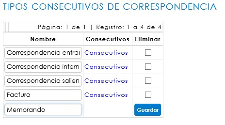

En el campo seleccionado se debe digitar el nombre que se dará al Tipo de consecutivo, de acuerdo al Tipo de correspondencia, si así se define. Al guardar se creará como parte de la lista.

El sistema indicará la cantidad de registros y páginas existentes en la parte superior del listado. Si éste supera los 5 registros, el sistema irá creando nuevas páginas, en las cuales se podrá consultar o editar el nombre del consecutivo. 

##### Consecutivos

Al ingresar a la ruta SGD / CONFIGURACIÓN / CORRESPONDENCIA / CONSECUTIVOS / CONSECUTIVOS se abrirá una página para la configuración de los consecutivos al Tipo de consecutivo creado.

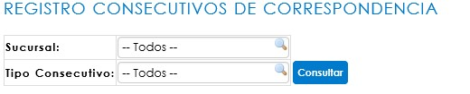

Los consecutivos de correspondencia deben estar vinculados a una sucursal de SINCO ERP, sobre la cual se haya definido el registro de la correspondencia. En esta opción se podrán aplicar filtros iniciales, ya sea por sucursal o por tipo de consecutivo creado. También, al hacer clic sobre el botón ***Consultar***, el sistema desplegará la tabla Configuración.

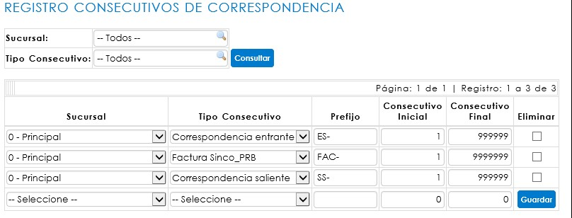

Si ya existen registros relacionados, no se podrán editar los consecutivos previamente configurados.

Para configurar un nuevo consecutivo, se debe iniciar con la selección de Sucursal y Tipo de consecutivo.

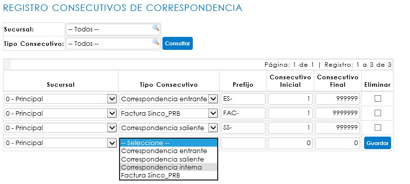

Una vez se hayan seleccionado los campos iniciales, se debe realizar la asignación del prefijo, dato de identificación que irá impreso en el sticker. Así mismo, se ingresarán los rangos de consecutivos, donde el inicial corresponde al número en que iniciará el código, y el final hace referencia al límite de dígitos al que llegará el consecutivo.

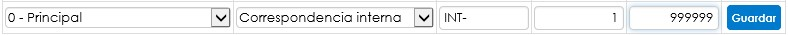

Para conservar los cambios, haga clic en Guardar.

<a href="#arriba">Ir arriba</a>

#### TIPOS DE CORRESPONDENCIA

Al ingresar a la ruta SGD/ CONFIGURACIÓN / CORRESPONDENCIA / TIPOS DE CORRESPONDENCIA, se abrirá un informe donde usted podrá consultar los tipos de correspondencia ya creados. En el caso de que requiera crear un nuevo tipo de correspondencia, debe hacer clic en el botón Nuevo.

##### CREACIÓN DE TIPOS DE CORRESPONDENCIA

Al hacer clic en esta opción, se abrirá un modal solicitando la información mínima requerida para crear un nuevo Tipo de correspondencia – Comunicados internos. 

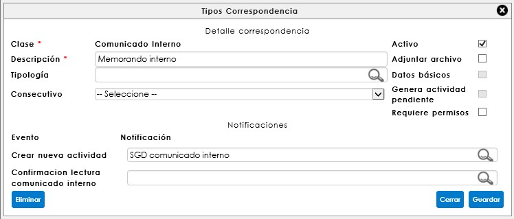

Los datos iniciales son:

**Clase**: Relacionado al tipo de correspondencia que se requiere crear: para este caso referenciaremos comunicados internos (memorandos).

**Descripción**: Hace referencia al nombre que identifica el tipo de correspondencia en el momento de la radicación. Este espacio de texto es obligatorio.

**Consecutivo**: Corresponde al código que será asignado como radicado de una comunicación, éste únicamente aplica para la clase Entrante y Saliente. Este campo no es obligatorio para el registro del tipo de correspondencia, sin embargo, condicionará la asignación del consecutivo de identificación al momento del radicado. Por ende, para el comunicado interno, este campo podrá dejarse sin asignar.

Esta página además permite determinar las condiciones de digitalización y registro de datos básicos, al momento de radicar o confirmar la correspondencia.

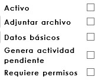

**Activo**: habilita el tipo de correspondencia que se está creando en la página de radicación de correspondencia, ya sea entrante, saliente o comunicado interno, para permitir su registro.

**Adjuntar archivo**: permite la digitalización del documento al momento de la radicación para la correspondencia entrante, comunicado interno y en la confirmación de entrega para la correspondencia saliente.

**Datos básicos**: habilita o deshabilita los datos básicos en el formulario de radicación. Solo aplica para la correspondencia entrante.

**Generar actividad pendiente**: Permite asignar múltiples destinatarios a la correspondencia, para ser notificados y generar actividad pendiente. Si se habilita esta casilla, no permitirá la configuración de un flujo programado.

**Requiere permisos**: Esta opción funciona para otorgar permisos sobre el tipo de correspondencia creado. Aplica para la clase de correspondencia interna. 

Desde esta ventana se deben asignar las notificaciones de acuerdo al tipo de correspondencia y flujo. Éstas vienen predefinidas y han sido diseñadas desde la configuración de SINCO ERP, a través de la ruta: Configuración/Sistema/Notificaciones/Consulta de notificaciones.

##### FLUJO PROGRAMADO

Una vez se ha creado el tipo de correspondencia, es necesario crear un flujo programado de un solo paso para ésta, en donde irán relacionados todos los ***usuarios asociados a un cargo***. Para consultar el flujo, se debe hacer clic en el ícono  , que corresponde a la opción de ***Edición de flujo programado***, y se encuentra ubicado en la columna de Acciones del informe de tipos de correspondencia.

<a href="#arriba">Ir arriba</a>

### RADICACIÓN DE CORRESPONDENCIA – COMUNICADOS INTERNOS

Desde la ruta: SGD/Correspondencia/Comunicados internos se encuentra el formulario de registro de la correspondencia. Esta opción del sistema permite gestionar y dar trámite a los memorandos internos, dejando la trazabilidad del envío, con la posibilidad de adjuntar el documento digitalizado si éste debe ser compartido con un grupo de personas específicamente. 

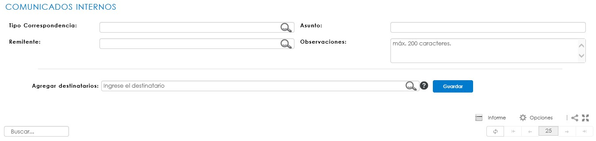

Para iniciar el registro de un memorando, el Tipo de correspondencia debe llevar el nombre del memorando que se enviará:

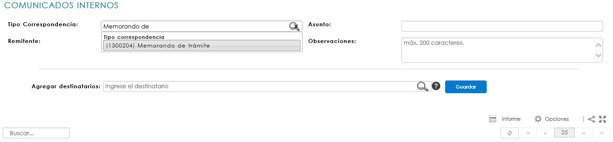

Debe seleccionar el tipo de comunicado interno y registrar el asunto del memorando; para copiar uno o más usuarios del sistema, deberá referenciarlos uno a uno en el mismo campo de destinatarios.

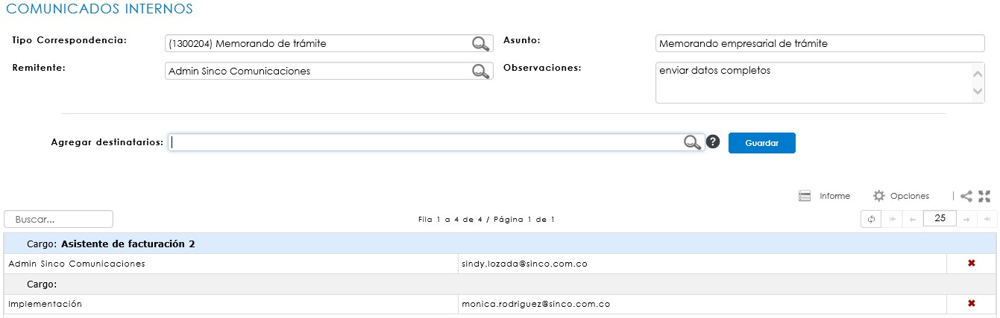

<a href="#arriba">Ir arriba</a>

### ACTIVIDADES PENDIENTES DE CORRESPONDENCIA

Desde la ruta SGD/correspondencia/actividades pendientes, es posible encontrar las actividades que un usuario tiene asignadas dentro de los flujos de correspondencia, como también visualizar un seguimiento. Dicho seguimiento puede visualizarse por Usuario o por Cargo, según lo establecido en el flujo programado del tipo de correspondencia parametrizado para el comunicado interno.

### INFORME DE COMUNICADOS INTERNOS

Desde la ruta: SGD/Correspondencia/CONSULTAS/COMUNICADOS INTERNOS/Control y seguimiento, es posible la consulta de los comunicados internos, garantizando un control detallado de todas aquellas comunicaciones generadas en la organización. Así mismo, es posible hacer seguimiento de manera global. En la ruta: SGD/Correspondencia/CONSULTAS/COMUNICADOS INTERNOS/Control y seguimiento (usuarios) es posible la consulta de los comunicados internos, con el mismo control detallado de todas aquellas comunicaciones en la organización, visualizadas por cada usuario notificado.

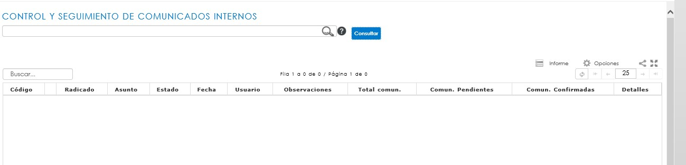
 
Este informe permite realizar consultas bajo diferentes criterios de búsqueda, como por ejemplo Tipo de correspondencia, los datos principales de registro, usuario, fechas de registro, entre otros.

<a href="#arriba">Ir arriba</a>

##### IR A [CONTENIDO](Manual_SGD.md)

##### ANTERIOR IR A [CORRESPONDENCIA ENTRANTE](correspondenciaEntrante.md)

##### SIGUENTE IR A [CORRESPONDENCIA INTERNA](correspondeciaInterna.md)
