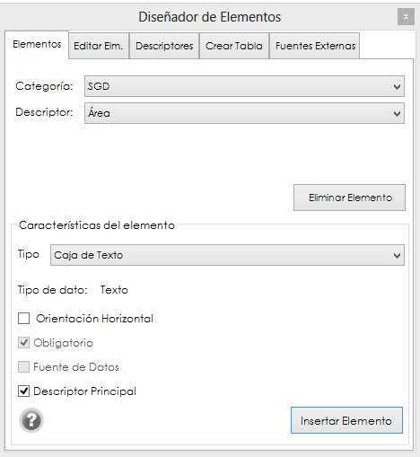
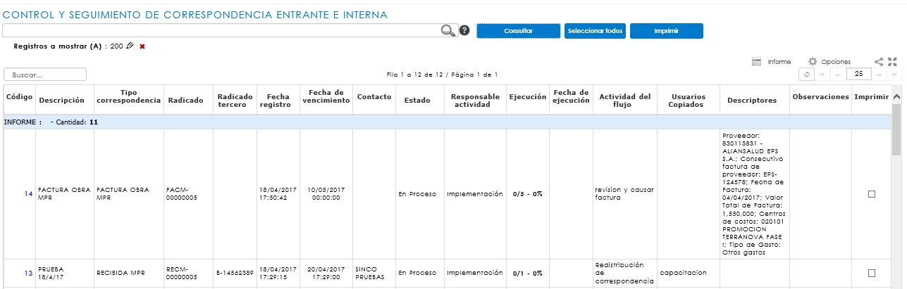

[INICIO](index.md)

## CORRESPONDENCIA INTERNA  

---
### CONFIGURACIONES PREVIAS  

Para que el módulo opere correctamente, debe ser parametrizado de acuerdo a la gestión de cada empresa, para facilitar la administración de la correspondencia.

#### CONSECUTIVOS DE CORRESPONDENCIA

Previo a la creación de los tipos de correspondencia, es necesario realizar la ***parametrización de los consecutivos***, para la correspondencia interna, en caso de ser requerido, podrá relacionarse o no un consecutivo que identifique los registros de dicho tipo de correspondencia.

#### TIPOS DE CORRESPONDENCIA

Al ingresar a la ruta SGD/ CONFIGURACIÓN / CORRESPONDENCIA / TIPOS DE CORRESPONDENCIA, se abrirá un informe en donde podrá consultar aquellos tipos de correspondencia ya creados. En el caso de que requiera crear un nuevo tipo de correspondencia, debe hacer clic en el botón ***Nuevo***.

#### CREACIÓN DE TIPOS DE CORRESPONDENCIA

Al hacer clic en esta opción, se abrirá un modal solicitando la información mínima requerida para crear un nuevo Tipo de correspondencia – Correspondencia interna. 

**Descripción**: Hace referencia al nombre que identifica el tipo de correspondencia en el momento de la radicación. Este espacio de texto es obligatorio.

**Tipología**: Este campo hace un vínculo a una tipología de la política de retención documental (aplica solo para correspondencia entrante e interna que requiera la asignación de datos adicionales), facilitando la ubicación de las correspondencias en una carpeta de archivo. Para realizar el vínculo es necesario digitar el código de la tipología tal como está registrado en la política de la compañía. 

Esta página también permite determinar las condiciones de digitalización y registro de datos básicos al momento de radicar o confirmar la correspondencia.

**Activo**: habilita al tipo de correspondencia que se está creando para permitir su registro en la página de radicación de correspondencia, ya sea entrante, saliente o comunicado interno.

**Adjuntar archivo**: permite la digitalización del documento al momento de la radicación de la correspondencia entrante y comunicado interno, y en la confirmación de entrega para la correspondencia saliente.

**Datos básicos**: habilita o deshabilita los datos básicos en el formulario de radicación. Solo aplica para la correspondencia entrante.

**Generar actividad pendiente**: Permite asignar las notificaciones a múltiples destinatarios a la correspondencia y generar actividad pendiente. Si se habilita esta casilla, no permitirá la configuración de un flujo programado.

**Requiere permisos**: Esta opción funciona para otorgar permisos sobre el tipo de correspondencia creado. Aplica para la clase de correspondencia interna. 

Desde esta ventana se deben asignar las notificaciones de acuerdo al tipo de correspondencia y flujo. Éstas vienen predefinidas y han sido diseñadas desde la configuración de SINCO ERP, a través de la ruta: Configuración/Sistema/Notificaciones/Consulta de notificaciones.

#### FLUJO PROGRAMADO

Una vez se ha creado el tipo de correspondencia, es necesario crear un flujo programado para ésta con los pasos correspondientes, en donde irán relacionados todos los usuarios asociados a un cargo. Para consultar el flujo, se debe hacer clic en el ícono  , que corresponde a la opción de ***Edición de flujo programado***, y se encuentra ubicado en la columna de Acciones del informe de tipos de correspondencia.

<a href="#arriba">Ir arriba</a>

### RADICACIÓN DE CORRESPONDENCIA INTERNA

Desde la ruta: SGD > correspondencia > interna > correspondencia interna se encuentra el formulario de registro de la correspondencia. Esta opción del sistema permite gestionar y dar trámite a las correspondencias, dejando la trazabilidad del envío con la posibilidad de adjuntar el documento digitalizado, si lo necesita compartir con un grupo de personas relacionadas, bajo un flujo programado.
 
Para iniciar el registro de una correspondencia se debe llamar en el Tipo de correspondencia el tipo al cual se hará un registro:

<a href="#arriba">Ir arriba</a>

### RADICACIÓN DE CORRESPONDENCIA INTERNA A TRAVÉS DEL COMPLEMENTO EXCEL

Para llegar a ser posible el registro de una correspondencia interna a través del complemento Excel, se requieren unas parametrizaciones que interactúan con el módulo de SINCO SGC, adicionales a las configuraciones previas anteriormente mencionadas, debido a que el registro de este tipo de correspondencia se realizará a través de un formato previamente diseñado en Excel, registrado a una caracterización del sistema de gestión de la empresa.

#### CONFIGURACIONES ESPECÍFICAS

##### REGISTRO DE FORMATOS EN SINCO SGC

Seleccione la caracterización a la cual vinculará el formato de registro de la correspondencia interna, esto desde la ruta: SGC > gestión documental > Registro y consulta de subprocesos.

Cuenta con dos opciones para el registro de un formato, la primera es agregar un formato nuevo al proceso seleccionado, o puede tomar un formato ya creado y crear una nueva versión.

Tenga en cuenta que, en caso de seleccionar la opción Crear una nueva versión, se debe abrir el formato a editar y hacer clic sobre el Botón **Nueva versión**, esta opción solo estará disponible si el subproceso se encuentra en estado de registro.

##### REGISTRO DE SUBSERIE

El ingreso a la opción se hace a través de la ruta: SGD/Retención Documental/Política de retención documental. Es necesario que se parametrice a nivel de subserie la ubicación en donde se almacenarán los formatos del registro de la correspondencia interna.

Para que la integración sea efectiva, la subserie debe tener como medio de conservación la categoría documento electrónico. En disposición final debe ir la opción digitalización.

##### DISEÑO DEL FORMATO A TRAVÉS DEL COMPLEMENTO EXCEL

**Ingreso al complemento**

El ingreso a esta opción se hace a través de la siguiente ruta: Microsoft Excel/Pestaña SINCO ERP. 

En la ventana emergente debe ingresar con el mismo usuario y contraseña de Ingreso al ERP, así mismo deben seleccionar la empresa y la sucursal. Al dar clic en el botón Ingresar ubicado en la barra de menú, el sistema informará que ha ingresado al complemento. 

Estando registrado, Excel desplegará los nuevos menús que hacen parte del complemento y los datos del usuario registrado.

Para iniciar la creación de debe dar clic en la pestaña SGD de Excel. 

##### Registro y creación del formato 

Como requisito del sistema de gestión de calidad y basado en el procedimiento de creación de documentos, cada formato debe llevar la fuente y tamaño definido por la organización.

Una vez se encuentre en el complemento, debe dar clic en la pestaña SGD para ingresar a la opción de diseño. 

##### Registro de proceso y series 

Para el diseño y creación es prerrequisito que el formato ya se encuentre en estado de registro en el módulo SGC, teniendo en cuenta que en este punto el complemento trae el proceso que ha sido registrado en calidad. 

Para iniciar se deben llamar los siguientes campos: 

**Subserie**: el sistema desplegará las opciones de las subseries Comunicaciones internas (complemento Excel)” con sus precedentes de Dependencia/Serie, tal como han sido creadas previamente en el SGD por dependencia. 

**Subproceso**: el sistema permitirá seleccionar el subproceso sobre el cual se realizó el registro del formato en el SGC.

**Formato**: corresponde al nombre del formato creado tal como ha sido registrado en el SGC.

**Diseño de formato**
 
Una vez registrado en Microsoft Excel, al dar clic en **Diseñar** se abrirá una nueva página. Tenga en cuenta que esta página debe tener el nombre de Formato, lo que permitirá continuar con el diseño.

Para iniciar es indispensable dar clic en el botón VER, que despliega una ventana emergente con el nombre Diseñador de Elementos, que permite incluir los campos de descriptores al formato.

Esta ventana contiene las siguientes pestanas: 

Elementos: permite agregar o eliminar descriptores al formato, y asignarle características especiales como: la orientación en celdas, la obligatoriedad de diligenciamiento o si es el descriptor principal del formato. 

**Descriptores**: esta pestaña permite crear descriptores que bien puedes venir desde dos fuentes: Aquellos que pueden ser configurados desde el ERP, por estar registrados en otro de los módulos de SINCO, o a través de la pestaña Fuentes externas, los cuales deben ser creados sobre una Categoría, preferiblemente la que lleva el nombre de la dependencia que está creando el formato.

Fuentes externas: permite crear fuentes de datos externas que van a ser configuradas como un descriptor específico del SGD y no corresponden a descriptores configurables de otros módulos del ERP.

Editar elementos: permite observar la ubicación de los descriptores por celda, tabla y fila, así como editar desde aquí cuáles son obligatorios o qué descriptor ha sido definido como principal. 

**Creación y asignación de descriptores** 	

Al iniciar la creación del formato es importante tener en cuenta que se deben guardar las filas y columnas que se ocuparán en el encabezado, así como reservar una o más columnas que se consideren necesarias hacia la izquierda puesto que, para la ubicación de los descriptores, el sistema utiliza una columna a la izquierda si se trata de una orientación horizontal.

Una vez seleccionada la celda se podrá iniciar la asignación de descriptores, de acuerdo al diseño del formato. Desde la ventana Diseñador de elementos ubicada en la pestaña de Elementos, se debe llamar la categoría y el descriptor de acuerdo a la información que se desea recuperar. 

Al seleccionar la categoría y el descriptor, el sistema permite asignarle algunos atributos de acuerdo a las Características del elemento:

Orientación: el sistema tiene por configuración la orientación horizontal para la asignación de descriptores, sin embargo, si requiere que éste sea de tipo vertical, solo se debe retirar el check en esta casilla. 
Obligatorio: implica que este campo debe ser obligatorio y sin él, no se podrá finalizar el registro del formato.
Descriptor principal: implica que la información de registro de este descriptor, será el complemento del nombre dado al formato y una llave de búsqueda principal. 

Una vez configurados estos atributos, al dar clic en el botón **Insertar elemento**, el sistema lo agregará en la celda seleccionada. También es posible eliminar un descriptor que ya ha sido asignado, pero solo es posible hacerlo ubicándose en el campo en que se asignó (Celda de Color) y dando clic en el botón eliminar elemento. 

**Fuentes externas**

El sistema permite la creación de fuentes externas como descriptores que no puedan ser configurados desde el SGD o algún otro módulo del ERP. Para su configuración, se debe ingresar a la ventana de Diseñador de Elementos/Fuentes externas y diligenciar los siguientes campos: 

**Creación de tablas y diseño de formato**

Si el formato que se está diseñando incluye tablas, el complemento permite crearlas de dos formas: directamente desde el formato, con solo agregar los campos requeridos como una tabla en un Excel tradicional; o creando una tabla desde la ventada Diseñador de elementos, donde es posible recuperar información de descriptores configurados como columnas de una tabla.
 
Para la creación de esta tabla se debe dar clic en la pestaña de Crear tabla.

En esta opción es posible definir los descriptores según las categorías que serán asignadas como columnas a la tabla.

**Categoría**: se debe seleccionar la categoría de descriptores del área, la cual se convertirá en la fuente de datos para la asignación de descriptores como columna a la tabla. 

**Descriptores**: datos que han sido configurados en una categoría por fuentes externas o desde el ERP, y serán aquellos que se podrán agregar como descriptor a una columna en la tabla, con solo dar clic en el botón 
 .

**Nombre de la tabla ( * )**: el sistema exige la asignación de un nombre a la tabla como medio de identificación, sin embargo, ésta se puede ocultar una vez sea asignada al formato (*Campo obligatorio) durante del proceso de edición. 

**Cantidad de filas ( * )**: todas las tablas que se configuren en el complemento deben tener definidas las cantidad de filas que llevará el formato, teniendo en cuenta que una vez creado y aprobado en el SGC no será posible agregar más filas durante el registro por el usuario final (* Campo obligatorio).

Una vez asignados los descriptores como columnas de la tabla, es posible editar dando clic derecho sobre la ventada del listado:

**Eliminar**: retirar la Columna asignada a la tabla.

**Subir y bajar**: reorganizar las columnas de la tabla de acuerdo a su necesidad, sin requerir la eliminación el descriptor.  

Crear columna vacía: agregar una columna para registro de datos de forma manual, sin ser descriptor o fuente de datos externa. 

Para agregar la tabla se debe seleccionar la celda en el formato donde se requiere inicie la tabla y dar clic en el botón Insertar Tabla. 

El título de la tabla se podrá ocultar, así como también se podrá editar el título de las columnas vacías o aquellas que vienen de descriptores, sin que esto genere error en el registro. 

Tenga presente que en el espacio donde quede asignado el descriptor (Celda de Color), no se podrán editar, eliminar o combinar celdas. 

Al formato de la tabla ya creada se le pueden agregar atributos tradicionales de Excel, como cambiar el tipo de fuente, combinar títulos, ajustar tamaño de las celdas (Columnas y Filas), agregar formulas, entre otras categorías.

Ajustado el formato al diseño original, como se desea crear, es importante siempre dar clic en el botón guardar , que se encuentra ubicado al regresar a la pestaña SGD de Excel, para así validar que está siendo creado correctamente, dando clic en el botón se valida que no se han cometiendo errores en la asignación de descriptores o edición del formato.

Para agregar el encabezado que debe asignarse por estándar de los formatos de calidad, podrán usarse las celdas que han sido reservadas previamente. Se debe agregar el logo de la compañía justificado a la derecha, el nombre del formato tal como se registró en el SGC y  la Fecha de vigencia, donde se colocará la fecha dos días después de la fecha en que se elaboró el formato; esto incluirá el tiempo de aprobación del mismo por la Dirección de Sistemas de Gestión. De igual manera, la versión del documento siempre será 0.1.

En ese momento se debe dar clic nuevamente en el botón guardar  , y el sistema notificará si desea guardar la plantilla actual; al dar clic en SI, el sistema informará el formato se guardó correctamente.

Si hay algún error en la asignación de descriptores o en la creación de las tablas, el sistema notificará que no es posible guardar el formato.

Una vez ha finalizado la edición y se ha guardado el formato, se debe regresar a la pestaña SGD. Para confirmar y ver el estado del diseño, se debe desplegar el menú de la opción VISTA y seleccionar la opción Pre validación.

En este momento, el sistema confirma si se desea pasar al estado de Prevalidación. Al dar clic en Sí, el sistema vuelve a abrir el formato. 

En Pre validación es necesario probar que los campos de descriptores traigan los datos registrados por fuente de datos externas, o aquellos que son configurados del ERP, así como cada uno de los campos abiertos. Si al realizar la prueba el sistema informa que una celda está protegida o bloqueada, se debe regresar a la opción Edición para desbloquear las celdas. 

Al regresar el sistema notifica si se desea volver a la edición. Al dar clic en Sí en la ventana emergente regresará a la página de edición. 

Para desbloquear las celdas de diligenciamiento abierto, se deben seleccionar e ir a la opción ACCIONES y seleccionar Desbloquear Celda.

El sistema confirmará que las celdas han sido desbloqueadas, y en este momento se debe dar clic de nuevo en el botón Guardar    , y luego seleccionar de nuevo la opción VISTA/Prevalidación.

En el estado de Pre validación una vez se han validado todos los campos y descriptores, se debe dar clic en la opción VALIDAR FORMATO, momento en el que finaliza el diseño en el complemento Excel y se realiza el vínculo final con el SGC, donde queda integrado al área el formato creado al subproceso.
 

Si el formato ha sido correctamente creado, el sistema informa que las Validaciones son correctas y se puede cerrar el formato, regresando a la pestaña SGD y dando clic en el botón Cerrar. Así se podrá iniciar la creación de uno nuevo.

Si las validaciones no son correctas, el sistema notificará qué está ocurriendo. Si hay errores en la asignación de descriptores o datos, no permitirá finalizar hasta tanto no se verifique el formato a través de la opción Edición.  

#### RADICACION DESDE MICROSOFT EXCEL 

Dicho formato debe ser aprobado desde SINCO SGC por el responsable del proceso al cual éste se haya vinculado. Después de ello, para poder hacer un registro sobre el formato, deberá ingresar nuevamente al Excel. Aquí ingresará una vez más con su usuario, y podrá traer el formato para generar un registro.

Seleccione el subproceso y el formato que desea usar. A continuación haga clic en **Abrir**.  Diligencie los respectivos campos y cuando tenga el registro completo, remítase a la pestaña SGD y dé clic en **Guardar**.
 

Después de dar clic en guardar y de acuerdo al flujo de correspondencia que haya establecido para el formato, podrá remitir dicho documento a un responsable, y éste iniciará el respectivo flujo documental de aprobación de la correspondencia interna.

<a href="#arriba">Ir arriba</a>

### ACTIVIDADES PENDIENTES DE CORRESPONDENCIA

Desde la ruta SGD/correspondencia/actividades pendientes, es posible encontrar las **actividades pendientes** que un usuario tiene asignadas dentro de los flujos de correspondencia, así como también visualizar un seguimiento. Éstos pueden ser presentados por Usuario o por Cargo, según lo establecido previamente en el flujo programado del tipo de correspondencia parametrizado para el comunicado interno.

<a href="#arriba">Ir arriba</a>

### INFORME DE CORRESPONDENCIA INTERNA

Desde la ruta: SGD/Correspondencia/CONSULTAS/ENTRANTE E INTERNA/Control y seguimiento, es posible la consulta de correspondencia interna, garantizando un control detallado de todas aquellas comunicaciones radicadas en la organización o gestionadas a través de formatos internos de calidad (Complemento Excel). Asimismo, es posible hacer seguimiento de los flujos programados de correspondencia de manera global. Por último, en la ruta: SGD/Correspondencia/CONSULTAS/ENTRANTE E INTERNA/Control y seguimiento (usuarios) se consultará la correspondencia interna con el mismo control detallado de todas aquellas comunicaciones radicadas en la organización, visualizadas por cada usuario.

Este informe permite realizar consultas bajo diferentes criterios de búsqueda, como Tipo de correspondencia, los datos principales de registro y descriptores como: tipo de correspondencia, estado de la correspondencia, contacto, usuario, fechas de registro entre otros.

Para conocer el detalle de una correspondencia es necesario dar clic sobre la comunicación, inmediatamente cargará un modal donde se muestran los archivos digitalizados o adjuntos que han sido cargados en la radicación, así como el Seguimiento de Actividades y participantes del flujo programado de correspondencia y los Descriptores del registro. 

Para visualizar la imagen, se debe dar clic en el hipervínculo del recuadro Detalle de correspondencia que abrirá una ventana emergente para confirmar la apertura del archivo.

<a href="#arriba">Ir arriba</a>

##### IR A [CONTENIDO](Manual_SGD.md)

##### ANTERIOR IR A [COMUNICADOS INTERNOS](comunicadosInternos.md)

##### SIGUENTE IR A [CORRESPONDENCIA SALIENTE](correspondeciaSaliente.md)

