[INICIO](index.md)

## CORRESPONDENCIA SALIENTE 

---
### CONFIGURACIONES PREVIAS  

Para que el módulo opere correctamente se requiere una parametrización de acuerdo a la gestión de cada empresa, con esto será posible la administración de la correspondencia.

#### CONSECUTIVOS DE CORRESPONDENCIA

Previo a la creación de los tipos de correspondencia, es necesario realizar la parametrización de los consecutivos para la correspondencia interna. En el evento en que se requiera, podrá relacionarse un consecutivo que identifique los registros de dicho tipo de correspondencia.

#### FORMAS DE ENTREGA

Desde la ruta: SGD/Configuración/CORRESPONDENCIA/SALIENTE/Formas de entrega, es posible configurar las formas en que la empresa realizará la distribución de la correspondencia, pueden crearse opciones cuantas sean necesarias. Recuerde que esto varía de acuerdo a las condiciones de envío. 

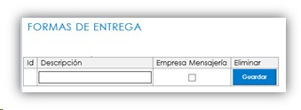

#### TIPOS DE CORRESPONDENCIA

Al ingresar a la ruta SGD/ CONFIGURACIÓN / CORRESPONDENCIA / TIPOS DE CORRESPONDENCIA, se abrirá un informe en donde usted podrá consultar aquellos tipos de correspondencia ya creados. En el caso de que requiera crear un nuevo tipo de correspondencia, debe hacer clic en el botón ***Nuevo***.

##### CREACIÓN DE TIPOS DE CORRESPONDENCIA

Al hacer clic en esta opción, se abrirá un modal solicitando la información mínima requerida para crear un nuevo Tipo de correspondencia – Correspondencia saliente.

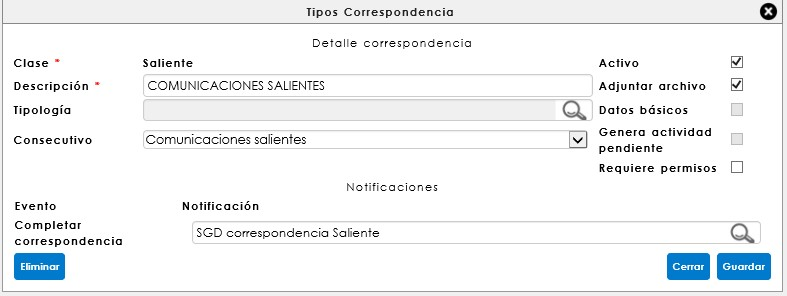

<a href="#arriba">Ir arriba</a>

### RADICACIÓN DE CORRESPONDENCIA SALIENTE

Desde la ruta: SGD/correspondencia/saliente/correspondencia saliente encontrará el formulario de registro de la correspondencia. Esta opción del sistema permite gestionar y dar trámite a las comunicaciones salientes, dejando la trazabilidad del envío con la posibilidad de adjuntar el documento digitalizado, que se debe enviar a un grupo de personas específicamente.

Para iniciar el registro de una comunicación se debe llamar en el Tipo de correspondencia que se enviará, paso seguido podrá diligenciar los campos de registro:

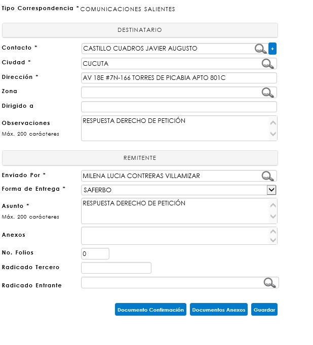

Para finalizar y generar el consecutivo de radicación, se debe dar clic en el botón **Guardar**.

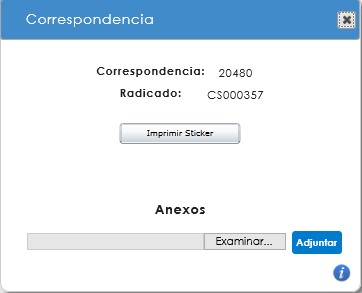

Para adjuntar un documento se selecciona el botón 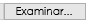 , se debe seleccionar el archivo a cargar desde el equipo donde está ubicado y dar clic en el botón   para anexar el documento.
 
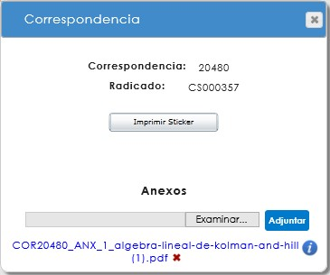

<a href="#arriba">Ir arriba</a>

### RADICACIÓN DE CORRESPONDENCIA SALIENTE A TRAVÉS DEL COMPLEMENTO WORD

#### CONFIGURACIONES ESPECÍFICAS

**Descarga del complemento Word y licencia** 

Ingrese a la opción de configuración dentro de SINCO ERP, seleccione SISTEMA y dé clic en COMPLEMENTO OFFICE.

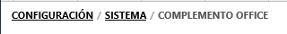

En la página encontrará una serie de pasos para descargar el complemento y su correspondiente licencia.

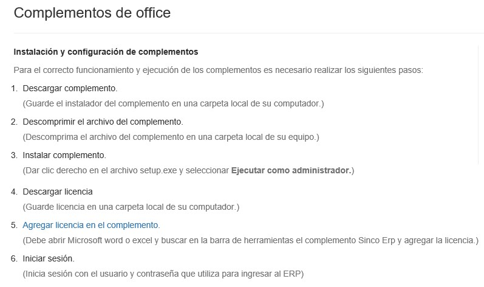

Haga clic en el hipervínculo llamado Descargar complemento Word y guárdelo en un sitio local de su ordenador. 

Descomprima el formato .Zip.

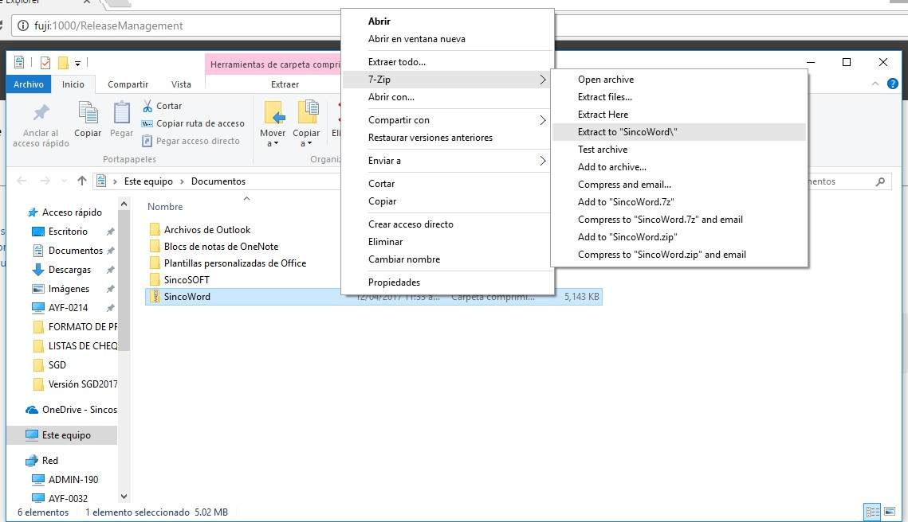

Seguido a ello, ejecute la acción de instalación sobre la aplicación Setup y Sincoword.

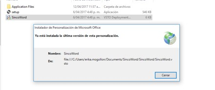

A continuación, remítase a **SINCO ERP** y descargue la licencia desde el hipervínculo relacionado. 

Como paso siguiente abra un documento de **WORD** y seleccione la pestaña llamada **SINCO ERP**, proceda continuamente a dar clic en iniciar sesión, esto abrirá un modal dentro del programa. En la parte inferior del mismo hay un icono en forma de herramienta 
  , dé clic sobre él.

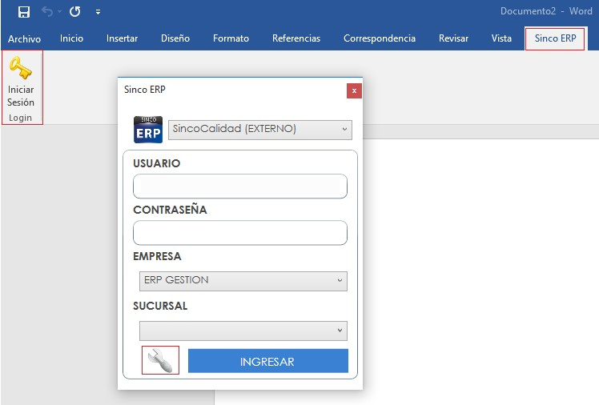

Se abrirá automáticamente una ventana la cual le permitirá seleccionar la ruta interna del complemento. Para configurar la ruta interna, proceda a dar clic en el botón BUSCAR INTERNA, seleccione la licencia guardada y dé clic en Abrir. 

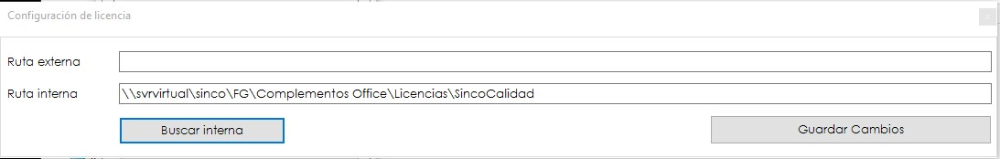

Por último, haga clic en **GUARDAR CAMBIOS** para dar por finalizado el proceso de asociación de la licencia a Word. 

**Diseño de la plantilla de comunicación saliente en Microsoft Word**

Para iniciar con el uso del complemento de WORD, haga clic sobre la pestaña **SINCO ERP** ubicada en la cinta de opciones de WORD. Esta pestaña abrirá un modal que le permitirá registrar sus datos de ingreso a SINCO ERP.

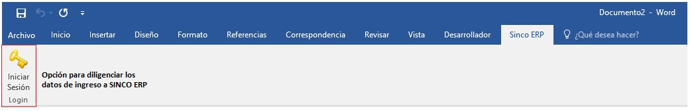

Al dar clic en la opción **INICIAR SESIÓN** diligencie la información solicitada por el modal habilitado y dé clic en **INGRESAR**. 

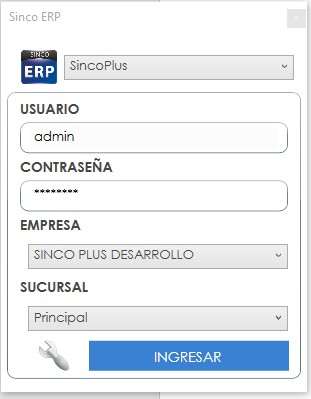

Después de haber ingresado se habilitará tres pestañas más a la ventana de Word, las cuales corresponden al nombre de **(ADPRO, SGD, SGP)**. Para este caso haga clic en **SGD**. 

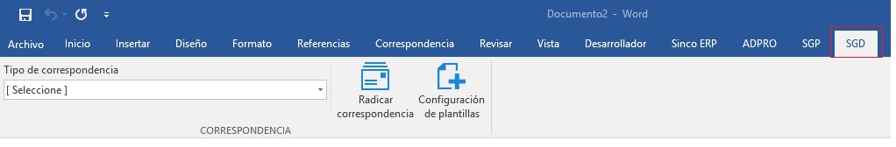

Después de haber ingresado se habilitará tres pestañas más a la ventana de Word, las cuales corresponden al nombre de (ADPRO, SGD, SGP). Para este caso haga clic en SGD.

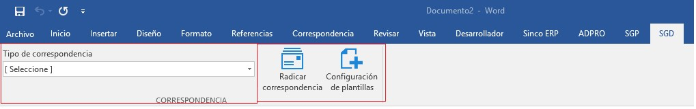

Como primera medida, seleccione un tipo de correspondencia previamente creado, y luego haga clic en **CONFIGURACIÓN DE PLANTILLAS** para configurar la plantilla según el **tipo de correspondencia**.

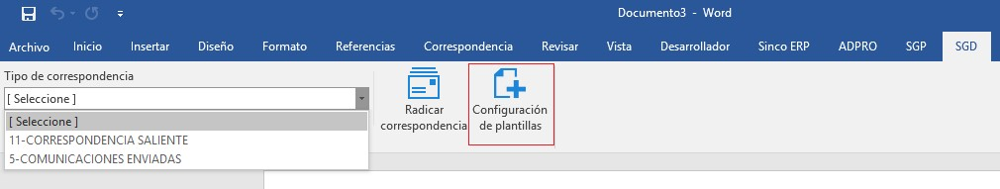
 
Para la configuración de la plantilla debe dar clic en **AGREGAR VARIABLES**. Esta opción muestra una sección llamada **DATOS DE LA CORRESPONDENCIA**, la cual permite asignar las variables a la plantilla. 

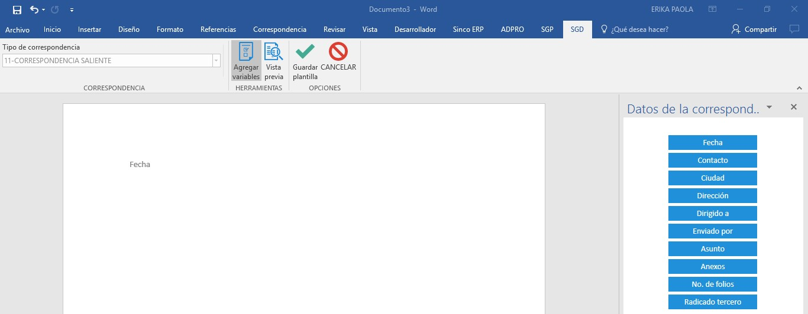

Diseñe la plantilla agregándole variables y texto, según como sea requerido. Al finalizar el proceso de diseño de la plantilla, haga clic en **VISTA PREVIA**. Esta opción le permitirá visualizar la plantilla antes de guardarla.
 
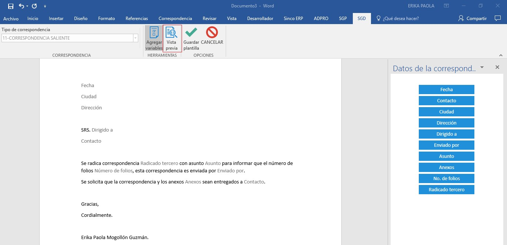

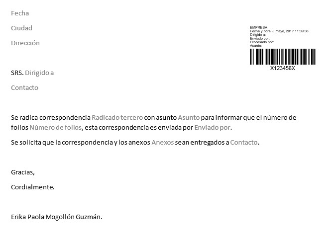

Al momento de finalizar la configuración de la planilla dé clic en **GUARDAR PLANILLA** para poder comenzar con la radicación de una correspondencia. 

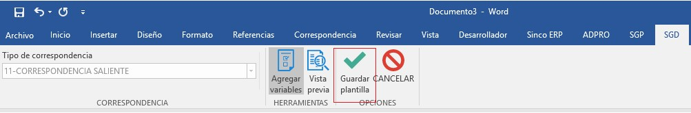

#### RADICACIÓN DESDE MICROSOFT WORD

Haga clic la opción en Microsoft Word **RADICAR CORRESPONDENCIA**, paso seguido continúe en **AGREGAR DATOS**, donde podrá diligenciar los datos requeridos para radicar una correspondencia.
 
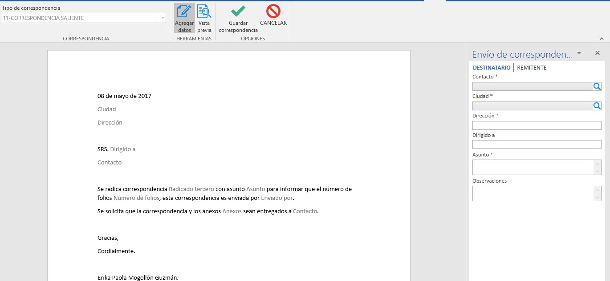

Diligencie los datos correspondientes al **DESTINATARIO/REMITENTE**. Tenga en cuenta que la variable fecha se diligencia por defecto con la fecha del día en que esté radicando la correspondencia. 

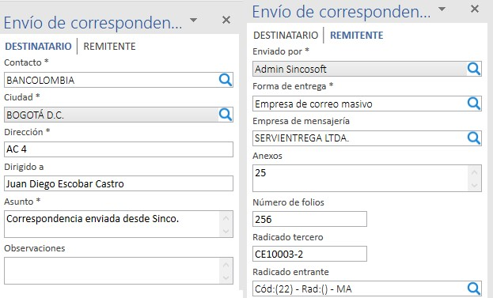

Al ir diligenciando los datos de la correspondencia, la plantilla simultáneamente irá tomando la información correspondiente a las variables agregadas en la plantilla. Para continuar a la vista previa de la correspondencia radicada, haga clic en el botón **VISTA PREVIA**.

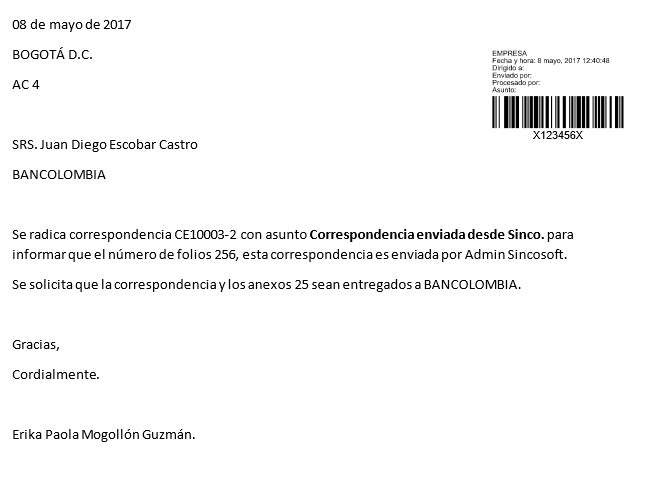

Por último, dé clic en **GUARDAR CORRESPONDENCIA**. Automáticamente, el sistema arroja un radicado para la correspondencia saliente, según como se haya configurado. En el momento que usted da clic en **ACEPTAR**, se abre automáticamente una ventana con el documento de la correspondencia.

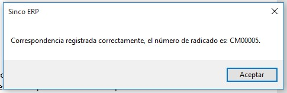

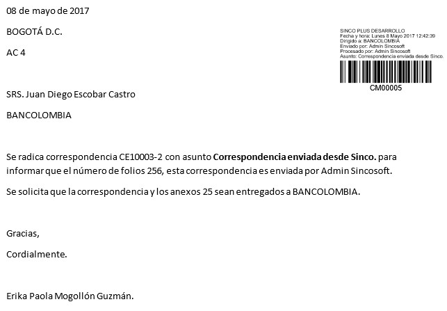

Dicha correspondencia ha sido generada y podrá ser consultada en los respectivos informes de **consulta** para su posterior seguimiento.

<a href="#arriba">Ir arriba</a>

### PLANILLAS

Desde la ruta: SGD/correspondencia/planillas se podrá gestionar una de las actividades indispensables de las correspondencias salientes: el despacho de las comunicaciones y el control de mensajeros a través de las planillas de envío. 
 
Esta opción del sistema permite crear y asignar planillas a los mensajeros, lo que garantiza un control y seguimiento detallado de las comunicaciones.

Con solo dar clic en el botón Guardar, esta planilla podrá ser guarda para ser editada posteriormente, si así se requiere. Su estado quedará en el informe general como pendiente, mostrando la fecha y hora de registro. 

Para editar esta planilla basta con dar clic en el botón **Editar** y se desplegará nuevamente la ventana emergente de ésta, donde se podrá editar agregando o eliminando comunicaciones.  Si ésta ya es definitiva, se debe dar clic en el botón **Confirmar** y el sistema alertará que no podrá editarse más adelante. Cuando se da clic en **desconfirmar**, en la planilla será posible realizar algún cambio sobre el despacho de la totalidad de las comunicaciones registradas, o si a última hora se requiere, asignar una nueva correspondencia.

Al dar clic en el botón   el sistema abrirá un PDF con la planilla lista para la impresión.

<a href="#arriba">Ir arriba</a>

### CONFIRMACION DE CORRESPONDENCIA SALIENTE

Al finalizar el proceso de entrega de la correspondencia externa, cuando el mensajero ha regresado a la empresa con el acuse de recibido de las comunicaciones, es necesario realizar la confirmación de entrega, para garantizar al usuario que sus envíos han sido entregados satisfactoriamente. Desde la ruta SGD/correspondencia/Saliente/confirmar correspondencia, podrá buscar una planilla que ha sido enviada, o también buscar las comunicaciones que se requieren confirmar. 

Para confirmar una correspondencia se debe seleccionar la comunicación dando clic sobre ella. En el formulario Confirmación de entrega se desplegará la información de la comunicación. 

En este formulario se debe registrar: Fecha de entrega, Nombre de quien recibe, Estado y Observaciones; deberá digitalizar la planilla de envió, en donde se evidencie el acuse de recibido del documento previamente enviado. Al dar clic sobre la opción del escáner, se abrirá la interfaz que se conectará con el escáner configurado e iniciará la digitalización de la comunicación.

Para finalizar el proceso, al dar clic en guardar, el sistema refrescará el informe indicando que se actualizó el archivo correctamente y desaparecerá la comunicación. Cuando se completa la correspondencia que se confirmó, ya no se muestra más en el informe de la planilla.

<a href="#arriba">Ir arriba</a>

### INFORME DE CORRESPONDENCIA SALIENTE

La consulta de correspondencia saliente desde la ruta: SGD/correspondencia/consultas/saliente/control y seguimiento, garantiza el llevar un control detallado de todas aquellas comunicaciones producidas por la organización, y que requieren ser tramitadas ante un tercero; así mismo, es posible conocer el estado del despacho de la correspondencia. 

Aquellas comunicaciones que están en estado Entregado, permiten la visualización de la imagen con el acuse del recibido, y la evidencia en el informe se encuentra en la columna Archivo; donde aquellas que han sido digitalizadas muestran el ícono de documento , o por el contrario, un ícono de alerta  indicando que no tiene imagen.
 
Para procesos descentralizados de correspondencia, el sistema permite la impresión masiva de rótulos, seleccionado aquellas comunicaciones marcando el check en la columna “Imprimir”  o clic en el botón **Seleccionar**, si se requiere imprimir la totalidad de los rótulos de la consulta.
 
Se debe dar clic en el botón **Imprimir**, luego en la ventana emergente, se debe hacer clic en Imprimir sticker para realizar el proceso de impresión de los rótulos. 

A su vez, es posible la edición de la correspondencia. Al filtrar la correspondencia se debe hacer clic sobre el hipervínculo del código en la columna que lleva este nombre, en ese momento se desplegará una ventana emergente con el detalle de la correspondencia.

En la pantalla se puede visualizar la información que fue registrada en el formulario inicial. Al hacer clic en el botón **Editar**, el sistema abrirá una nueva ventana donde habilitará nuevamente el formulario de registro. 
 

Una vez culmine los cambios sobre el registro de la correspondencia, deberá dar clic en Guardar para que los cambios sean registrados.

<a href="#arriba">Ir arriba</a>

##### IR A [CONTENIDO](Manual_SGD.md)

##### ANTERIOR IR A [CORRESPONDENCIA INTERNA](correspondenciaInterna.md)

##### SIGUENTE IR A [ARCHIVO](archivo.md)